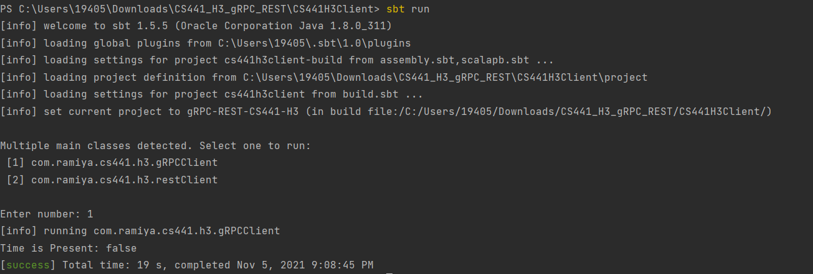

## CS441 - Engineering Distributed Objects for Cloud Computing

## Homework 3 - gRPC Lambda - REST

### RAMIYA SHREE SESHAIAH

### Introduction
The objective of this homework is to create and implement RESTful service and a lambda function that are accessed from the clients using gRPC.

Video Link : https://youtu.be/v_DO5JzDbi4

### Requirements

SBT installed on your system
Installed and configured AWS CLI on your machine

### Running the test file

Test File can be found under CS441H3Client/src/test/scala/ClientTest

````
sbt clean compile test
````

### Running the project

1) Clone this repository

```
git clone https://github.com/RamiyaShreeSeshaiah/CS441_H3_gRPC_REST.git
```
```
cd CS441_H3_gRPC_REST
```

2) Open the project in intelliJ

3) Generate jar file by running the following commands in the terminal. This jar file is the uploaded as AWS Lambda function

```cd CS441H3Server``` 
````sbt clean compile ```` 
```sbt assembly```

4) To run Client program, move to ``cd CS441H3Client`` and run ```sbt sun```

choose appropriate client : gRPC  - 1 and REST - 2 

### API EndPoints URLs

The API is deployed using AWS API Gateway 

grpcEndPoint = "https://koazj6rkt3.execute-api.us-east-2.amazonaws.com/default/grpcBinarySearch"

restEndPoint = "https://t323213c5g.execute-api.us-east-2.amazonaws.com/prod/restapi"

These endpoints are the API gateway of the Lambda Functions. 

Note : End Points, Time Input. Time Interval is mentioned in the `application.conf` file.

### Project Structure

1) The project has two folders CS441H3Client and CS441H3Server

2) CS441H3Client : Consist of gRPCClient and RESTClient

3) CS441H3Server : Consist of gRPCServer and RESTServer(LAMBDA FUNCTIONS)

### gRPC - Remote Procedure Call

gRPC is a modern, lightweight open source RPC framework from Google that may be used everywhere. It makes it easier to develop connected systems by allowing client and server programs to communicate transparently.

Protocol Buffers (Protobuf) is a cross-platform library developed by Google for serializing and deserializing structured data that is free and open source. It can be used to create programs that communicate with one another via a network or to store data.

Using gRPC, Client program invokes a lambda function deployed on AWS to determine if the desired timestamp is in the log file

**Input :** Time(HH:MM:SS.ss) 

**Output**: 

**1) YES :** If the desired timestamp is present

**2) NO :** If the desired timestamp is not present

A client program can use gRPC to call a method on a server application on another machine as if it were a local object, making it easier to develop distributed applications and services. This interface is implemented on the server side, and a gRPC server is used to handle client requests.

**gRPC Client : (CS441H3Client/src/main/scala/gRPCClient)**

The gRPC Client sends a request to the Lambda function with the input(time - HH:MM:SS.ss) parameter and receives the response after the request is processed by the lambda function.

**gRPC Server : (CS441H3Server/src/main/scala/gRPServer)**

When the request reaches the lambda function and the input is sent to the binarySearch function (CS441H3Server/src/main/scala/BinarySearchgRPC).
This function performs a binary search in the log file for the desired time.

Protobuf for client server communication

``````
syntax = "proto3";

service logTimeFunction {
rpc TimeFunction(TimeData) returns (TimeResponse);
}

message TimeData {
string time = 1;
}

message TimeResponse {
bool result = 1;
}
```````

TimeFunction(TimeData) : Is the Input Message with one parameter

TimeResponse : Is the bool output

### REST - Representational state transfer

When a RESTful API is invoked, the server sends a representation of the requested resource's current state to the client.

When submitting an API request to a server, two items must be provided:

 1) The resource's unique identification. The resource's URL, also known as the endpoint, is this.

 2) In the form of an HTTP method or verb, the operation to be done on that resource. GET, POST, PUT, and DELETE are the most frequent HTTP methods.

Client should determine if the log files contain messages in the given time interval from the designated input time stamp and return an MD5-generated hash code from these messages or some 400-level HTTP client response to designate that the log files do not contain any messages in the given time interval given the input of time stamp and time interval server.

Input : Time(HH:MM:SS.ss) and Time Interval(HH:MM:SS.ss) 
Processed Input : Lower Time Interval and Upper Time Interval (plus and minus of time and time interval)

**EG:** Input1 : Time(09:58:55.569) and Input2 : Time Interval(00:00:01.000).
Lower and Upper Time Interval :  9:57:55 and 9:59:55.

**Output:** 
1) When log messages are present between the time interval : 200 status code with the MD5 Hash Message of the log message between those time intervals.
2) When log messages are not present between the time interval : 400 status code with No log message

**REST Client : (CS441H3Client/src/main/scala/gRPCClient)**

Rest Client sends a request to the server with input time(HH:MM:SS.ss) and time interval(HH:MM:SS.ss) to retrieve log messages between the intervals.

Once the server processes the request the client receives the response with MD-5 hash message if log message exist or 400 level error message if the log messages does not exist between the interval.

**gRPC Server : (CS441H3Server/src/main/scala/gRPServer)**

The input sent from the client is processed to get the "lower time interval(adding Time and Time Interval)" and "Upper Time Interval(subtracting Time and Time Interval)".
This input is passed to the binarySearch (CS441H3Client/src/main/scala/BinarySearchRest) to find the log messages between the interval.

##BinarySearch

Binary search is a fast way to find a specific item in a sorted list of things. It works by dividing the section of the list that could contain the item in half until you've reduced down the options to just one.
These binary search functions uses logFiles stored in S3 bucket generated by the EC2Instance which runs the Log File Generator that produces the log files.


**1)BinarySearchGrpc** 

Performs a binary search in the log file to see if the required TimeStamp is present or not.

**2) BinarySearchRest**

Binary search is used to look for log entries between the upper and lower time ranges. If log entries are detected, the MD-5 hash algorithm is used to hash the log messages.

Note: BinarySearch functions are written in Java

### Uploading Lambda Functiosn to the AWS

1) Create Lambda functions in AWS
2) Create Trigger points as API Gateway 
3) Upload the .jar file
4) Set the handler configuration
   ```<PackageName>.<ClassName>::<HandlerFunctionName>```

### Deployment steps - lambda, ec2, s3

In AWS, EC2 Instances is created (Follow steps mentioned in the video) 

1) Create EC2 Instance.
2) Connect using ssh command with key-pair
3) Move the Log Generator Project to run in the EC2 Instance using `scp -i ./<key-pair.pem> -r <Path to the folder> ec2_user@<amazon_ec2_instance_ip>:<destination path in ec2>`
4) Run the Log generator using `sbt run`
5) Move the log files generated to S3 bucket using `aws s3 cp <Log File> s3://<S3 Bucket>`

Crontab stands for “cron table" it is used to schedule job to execute tasks;

Bash Script to run the LogFileGenerator
```#!/bin/bash
cd LogFileGenerator-1
sbt run
aws s3 cp log s3://<bucketname>/ --recursive
```

The following is the cron command to schedule the job for every 6 hours
`````
0 */5 * * *bash /home/ec2-user/<bashfilename>.sh
`````
### Output

GRPC Client Response if TimeStamp is present in the log file


GRPC Client Response if TimeStamp is not present in the log file



REST Client Response with Status Code as 200 and MD5 Hashed Log Messages if log entries are present between the log time interval


REST Client Response with Status Code as 404 if log entries are not present between the log time interval


